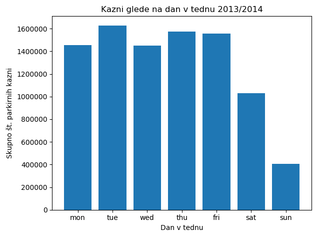
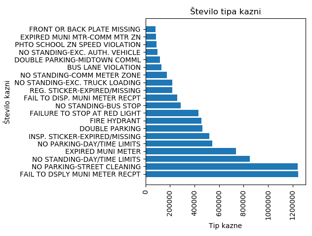
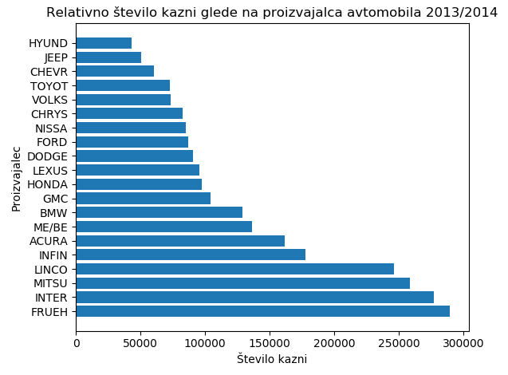
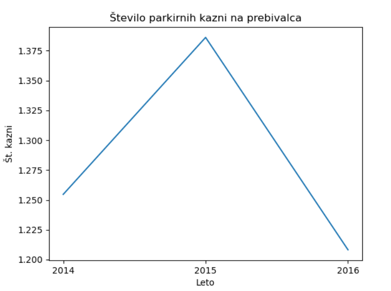
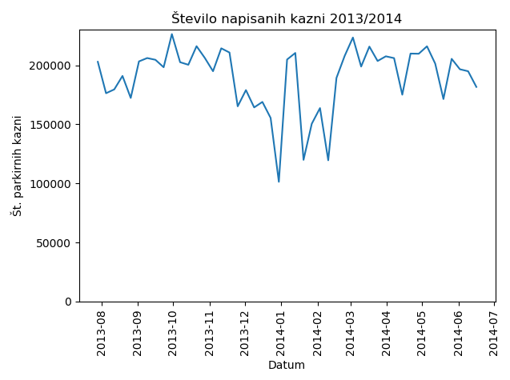
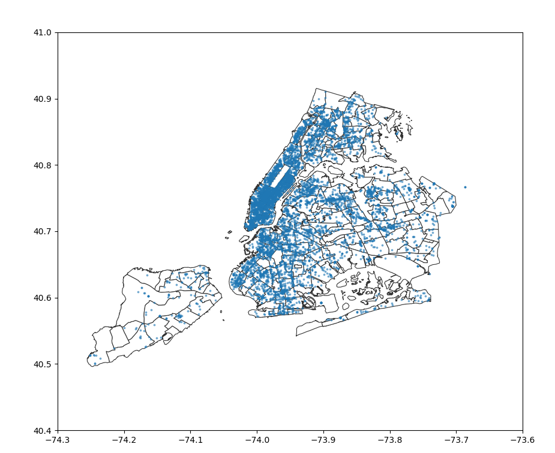

# PR20NLMCDAJVLK - Analiza parkirnih kazni v NYC
____________
Projektna naloga, Podatkovno rudarjenje, 2020

### Avtorji:
____________
* Nejc Ločičnik
* Matic Cavalleri
* Domen Antlej
* Jure Vukina
* Luka Kalezić

### Kazalo
* [Uvod](#uvod)
* [Izbor in oblika podatkov](#izbor_oblika_pod)
* [Osnovne vizualizacije](#osnovne_viz)
* [Vizualizacije zemljevida](#map_viz)
* [Priporočilni sistem](#prip_sistem)
* [Problemi](#problemi)

### Uvod 

### Izbor in oblika podatkov 
____________
Podatke smo pridobili iz: https://www.kaggle.com/new-york-city/nyc-parking-tickets#Parking_Violations_Issued_-_Fiscal_Year_2017.csv

Kot osvnovi nabor podatkov smo izbrali ogromno podatkovno bazo parkirnih kazni v NYC med avgustom 2013 in koncom leta 2017 
(razdeljeni na "fiscal year"). Atribute podatkov lahko povzamemo v naslednjih skupinah:
* podatki o avtomobilu (npr. firma, tip, barva, registracija, ...)
* podatki o lokaciji (npr. okrožje, ulica, križišče, ...)
* podatki o enoti, ki je izdala kazen (npr. enota, oseba, ...)
* časovni podatki (npr. čas in datum kršitve, čas prve opazitve,...)
* podatki o kazni (npr. koda kazni, opis, ...)

Skupaj predstavljajo do 51 atributov (odvisno od leta). Našo osnovo bomo po potrebi tudi dopolnjevali s pomožnimi podatki za normalizacijo ali primerjavo.

### Osnovne vizualizacije
_______________________
Za začetek smo za boljše razumevanje podatkov in kaj vse lahko z njimi naredimo vizualizirali nekaj osnovnih porazdalitev.

### Vizualizacije zemljevida 

### Priporočilni sistem 

Za priporočilni sistem smo se zanašali na koordinate (latitude, longitude), tako da nam ni preostalo druga kot uporaba koordinat, katere nam je uspelo dekodirati iz naslvov v podatkih (uporabljeni sicer za heatmap zgoraj). Ce jih se enkrat vizualiziramo zgledajo takole:

### Problemi 
__________________
Manjši problem smo imeli pri nejasnih vrednostih, tipkarskih napak ali celo napačnih (datum) pri določenih atributih, kar smo k sreči lahko zaradi same velikosti podatkov (miljone primerov) ignorirali (cel primer).

Precej nadležna je tudi časovna porazdelitev podatkov na "fiscal" (davčno??) leto, tako da so podatki enega leta namesto od zacetka janurja do konca decembra porazdeljeni od zacetka junija do konca julija.

Sama prednost velike množice podatkov je žal tudi velik problem, saj imamo težave pri poganjanju kode na celotni množici. Velik del atributov je praznih, tako da bomo poskusili te odstraniti. Samih primerov kazni nočemo odstranjevati, saj bi s tem zabrisali kakšne, morda prej bolj očitne vzorce.

### Končni cilji
___________________
Prvi cilj je čim bolje podatke predstaviti že z samo vizualizacijo (npr. izris heatmapa kazni in primerjava po demografiji ali dohodku ulic). Drugi pa bi bil neke vrste sistem, ki nam glede na našo lokacijo (ulico) priporoči kje lahko v bližini "ilegalno" parkiramo z najmanjšo verjetnostjo kazni.
