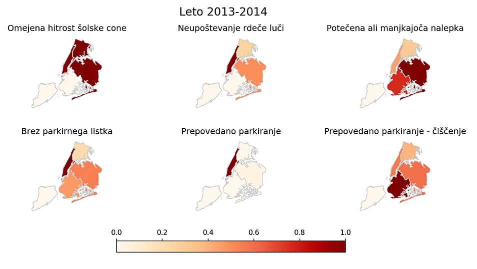
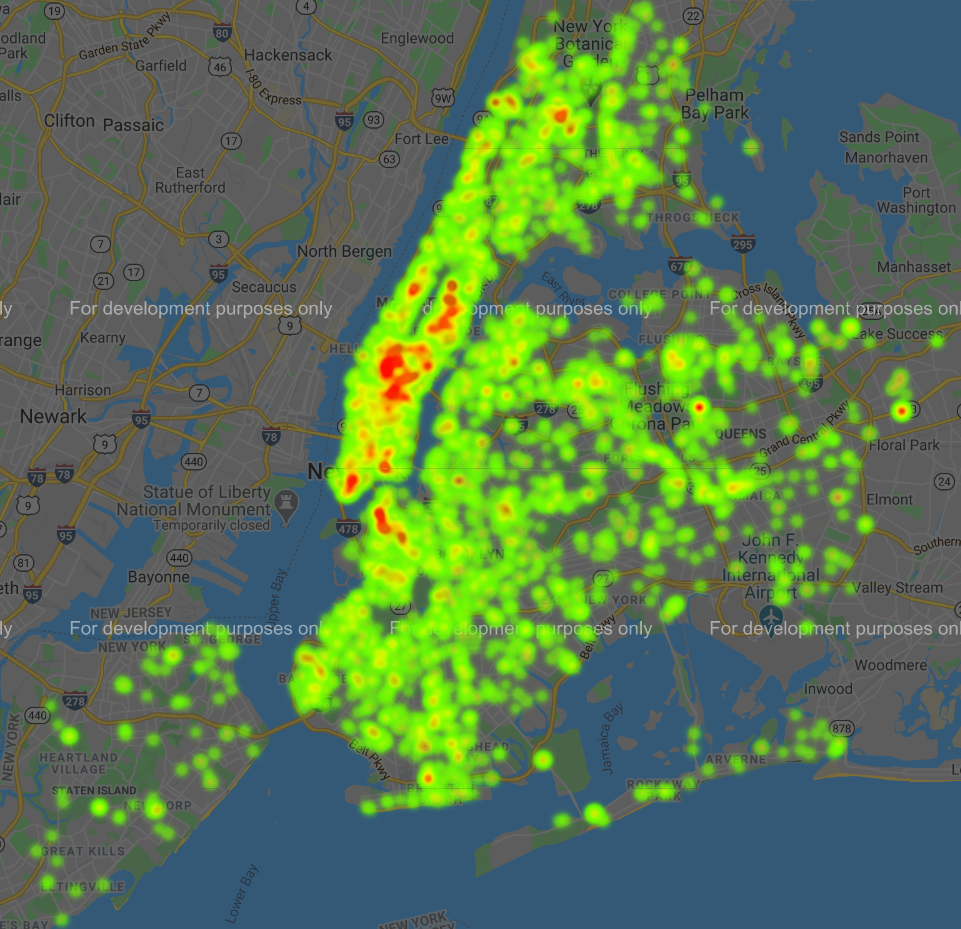
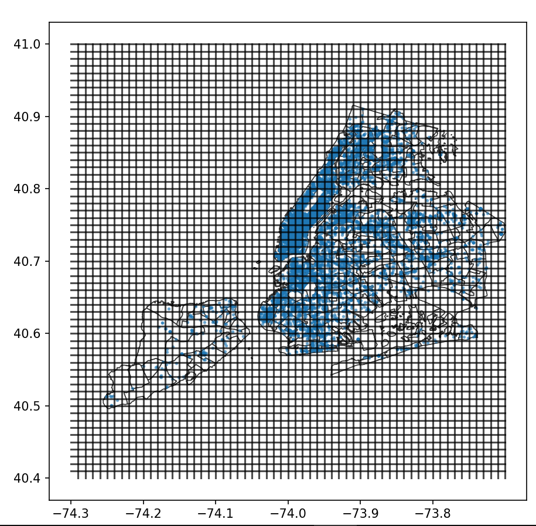

# PR20NLMCDAJVLK - Analiza parkirnih kazni v NYC
____________
Projektna naloga, Podatkovno rudarjenje, 2020

### Avtorji:
____________
* Nejc Ločičnik
* Matic Cavalleri
* Domen Antlej
* Jure Vukina
* Luka Kalezić

### Kazalo
__________________
* [Izbor in oblika podatkov](#izbor_oblika_pod)
* [Osnovne vizualizacije](#osnovne_viz)
* [Vizualizacije zemljevida](#map_viz)
* [Priporočilni sistem](#prip_sistem)
* [Problemi](#problemi)

### Izbor in oblika podatkov 
____________
Podatke smo pridobili iz: https://www.kaggle.com/new-york-city/nyc-parking-tickets#Parking_Violations_Issued_-_Fiscal_Year_2017.csv

Kot osvnovi nabor podatkov smo izbrali ogromno podatkovno bazo parkirnih kazni v NYC med avgustom 2013 in koncom leta 2017 
(razdeljeni na "fiscal year"). Atribute podatkov lahko povzamemo v naslednjih skupinah:
* podatki o avtomobilu (npr. firma, tip, barva, registracija, ...)
* podatki o lokaciji (npr. okrožje, ulica, križišče, ...)
* podatki o enoti, ki je izdala kazen (npr. enota, oseba, ...)
* časovni podatki (npr. čas in datum kršitve, čas prve opazitve,...)
* podatki o kazni (npr. koda kazni, opis, ...)

Skupaj predstavljajo do 51 atributov (odvisno od leta). Našo osnovo bomo po potrebi tudi dopolnjevali s pomožnimi podatki za normalizacijo ali primerjavo.

### Osnovne vizualizacije
_______________________
Za začetek smo za boljše razumevanje podatkov in kaj vse lahko z njimi naredimo vizualizirali nekaj osnovnih porazdalitev.

Kot pričakovano je med delovnimi dnevi porazdelitev kazni skoraj enakakomerna, medtem ko je med vikendi zaradi manj prometa seveda nižja.

Porazdelitev firm avtomobilov tudi ni preveč presenetljiva, vrh in skoraj polovico seznama zasedajo ameriške firme, ostalo si pa delijo popularne evropejske in azijske firme.

// od jureta

// barplot tipa kazni po letih

### Vizualizacije zemljevida 
__________________
Nekaj kazni, ki se največkrat pojavijo in nekaj zanimivih (prekoračitev hitrosti v šolskih conah in neupoštevanje rdeče luči) smo z animacijo prikazali skozi leta na nivoju okrožij (boroughs). Prekoračitev hitrosti v šolskih conah in neupoštevanje rdeče luči lahko v prvih dveh letih (2013/2014 in 2015) ignorirate, saj jih niso vpisovali v to podatkovno bazo. Ob koncu 2015 pa so povečali število kamer za prekoračitev hitrosti v šolskih conah (http://www.nyc.gov/html/dot/downloads/pdf/speed-camera-report-june2018.pdf), tako da od takrat dalje tovrstna kazen vsako leto zraste. Ostale bolj popularne vrste kazni, kot so npr. prepovedano parkiranje, potečena ali manjkajoča nalepka itd. pa vidimo, da se bistveno ne spreminjajo skozi leta in ostajo v enakem razmerju med okrožji.

Pri drugi vizualizaciji pa smo poskusili pridobiti točne koordinate kazni glede na sestavljen naslov iz atributov hišne številke, ime ulice in ime okrožja. Tukaj smo naleteli na kar nekaj težav o katerih bomo več omenili na koncu. Sama prevedba z uporabo geopy (geocoders) je prepočasna za naših ~42M primerov, tako da smo to storili le za 10k primerov od katerih za ~30% ni dekodiralo lokacije.
Spodnja slika je prikazana z uporaba Googlovega API-ja Geocoding.

### Priporočilni sistem 
__________________
Priporočilnega sistema smo se lotili kar se da preprosto, a smo žal še vedno potrebovali lokacijo kazni v obliki koordinat (longitude, latitude), tako da smo se zanašali na samo ~7k koordinat iz zgornjega heatmap prikaza. Če jih še enkrat vizualiziramo zgledajo takole:

Nato smo celoten zemljevid razdelili na kvadratke (60x60), kot vidite na spodnji sliki in prešteli število kazni v vsakem.
 

Priporočilni sistem deluje tako, da uporabnik vnese naslov trenutne pozicije (lahko je točen naslov s hišno številko ali samo ulica npr. N/S WILLOUGHBY AVE), nato program izračuna kateremu kvadratku bi ta naslov pripadal in izbere sosednji kvadratek, ki vsebuje najmanj kazni pod pogojem, da ima manj kazni kot 80% jih vsebuje trenuten položaj. Izpiše naslov najboljše lokacije.

### Problemi 
__________________
Manjši problem smo imeli pri nejasnih vrednostih, tipkarskih napak ali celo napačnih (datum) pri določenih atributih, kar smo k sreči lahko zaradi same velikosti podatkov (miljone primerov) ignorirali (cel primer).

Precej nadležna je tudi časovna porazdelitev podatkov na "fiscal" (davčno??) leto, tako da so podatki enega leta namesto od zacetka janurja do konca decembra porazdeljeni od zacetka junija do konca julija.

Sama prednost velike množice podatkov je žal tudi velik problem, saj imamo težave pri poganjanju kode na celotni množici. Velik del atributov je praznih, tako da bomo poskusili te odstraniti. Samih primerov kazni nočemo odstranjevati, saj bi s tem zabrisali kakšne, morda prej bolj očitne vzorce.

### Končni cilji
___________________
Prvi cilj je čim bolje podatke predstaviti že z samo vizualizacijo (npr. izris heatmapa kazni in primerjava po demografiji ali dohodku ulic). Drugi pa bi bil neke vrste sistem, ki nam glede na našo lokacijo (ulico) priporoči kje lahko v bližini "ilegalno" parkiramo z najmanjšo verjetnostjo kazni.
