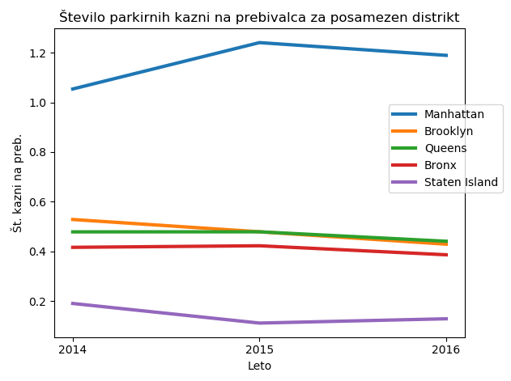
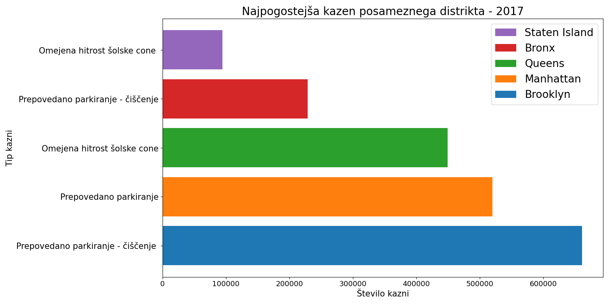
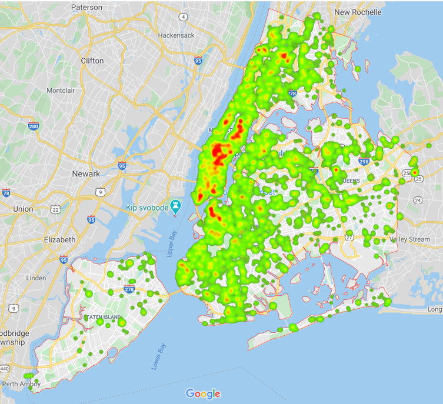

# PR20NLMCDAJVLK - Analiza parkirnih kazni v NYC
____________
Projektna naloga, Podatkovno rudarjenje, 2020

### Avtorji:
____________
* Nejc Ločičnik
* Matic Cavalleri
* Domen Antlej
* Jure Vukina
* Luka Kalezić

### Kazalo
__________________
* [Izbor in oblika podatkov](#izbor_oblika_pod)
* [Osnovne vizualizacije](#osnovne_viz)
* [Vizualizacije zemljevida](#map_viz)
* [Priporočilni sistem](#prip_sistem)
* [Problemi](#problemi)

### Izbor in oblika podatkov 
____________
Podatke smo pridobili iz: https://www.kaggle.com/new-york-city/nyc-parking-tickets#Parking_Violations_Issued_-_Fiscal_Year_2017.csv

Kot osvnovi nabor podatkov smo izbrali ogromno podatkovno bazo parkirnih kazni v NYC med avgustom 2013 in koncom leta 2017 
(razdeljeni na "fiscal year"). Atribute podatkov lahko povzamemo v naslednjih skupinah:
* podatki o avtomobilu (npr. firma, tip, barva, registracija, ...)
* podatki o lokaciji (npr. okrožje, ulica, križišče, ...)
* podatki o enoti, ki je izdala kazen (npr. enota, oseba, ...)
* časovni podatki (npr. čas in datum kršitve, čas prve opazitve,...)
* podatki o kazni (npr. koda kazni, opis, ...)

Skupaj predstavljajo do 51 atributov (odvisno od leta). Našo osnovo bomo po potrebi tudi dopolnjevali s pomožnimi podatki za normalizacijo ali primerjavo.

### Osnovne vizualizacije
_______________________
Za začetek smo za boljše razumevanje podatkov in kaj vse lahko z njimi naredimo vizualizirali nekaj osnovnih porazdalitev.

Kot pričakovano je med delovnimi dnevi porazdelitev kazni skoraj enakakomerna, medtem ko je med vikendi zaradi manj prometa seveda nižja.

Porazdelitev firm avtomobilov tudi ni preveč presenetljiva, vrh in skoraj polovico seznama zasedajo ameriške firme, ostalo si pa delijo popularne evropejske in azijske firme.

Pričakovali smo kak bolj očiten vzorec, amapak edino kar je razvidno je bistveno manjše število kazni okoli božica/novega leta.

Pri analizi kazni posameznih okrožij New York City od 2014 do 2016 smo ugotovili, da so med njimi kar velika nihanja. Brooklyn, Queens in Bronx imajo dokaj primerljivo število kazni na prebivalca, letno nihajo nekje med 0.4 in 0.55 na prebivalca. Staten Island in Manhattan pa kar opazno odstopata. Staten Island ima najmanj kazni, letno le do 0.2 na prebivalca , Manhattan pa daleč največ, kar od 1 do 1.2 na prebivalca.

Izračunali smo tudi najpogostejše kazni posameznega okrožja. Kar v treh je prejetih največ kazni zaradi prepovedanega parkiranja: v Brooklynu, Manhattanu in Bronxu. Pri tem je v Brooklynu in Bronxu specifično prepoved parkiranja v urah čiščenja cest. V drugih dveh okrožjih, Staten Islandu in Queensu, pa je najpogostejša kazen zaradi prehitre vožnje v šolski coni.

### Vizualizacije zemljevida 
__________________
Nekaj kazni, ki se največkrat pojavijo in nekaj zanimivih (prekoračitev hitrosti v šolskih conah in neupoštevanje rdeče luči) smo z animacijo prikazali skozi leta na nivoju okrožij (boroughs). Prekoračitev hitrosti v šolskih conah in neupoštevanje rdeče luči lahko v prvih dveh letih (2013/2014 in 2015) ignorirate, saj jih niso vpisovali v to podatkovno bazo. Ob koncu 2015 pa so povečali število kamer za prekoračitev hitrosti v šolskih conah (http://www.nyc.gov/html/dot/downloads/pdf/speed-camera-report-june2018.pdf), tako da od takrat dalje tovrstna kazen vsako leto zraste. Ostale bolj popularne vrste kazni, kot so npr. prepovedano parkiranje, potečena ali manjkajoča nalepka itd. pa vidimo, da se bistveno ne spreminjajo skozi leta in ostajo v enakem razmerju med okrožji.

Pri drugi vizualizaciji pa smo poskusili pridobiti točne koordinate kazni glede na sestavljen naslov iz atributov hišne številke, ime ulice in ime okrožja. Tukaj smo naleteli na kar nekaj težav o katerih bomo več omenili na koncu. Sama prevedba z uporabo geopy (geocoders) je prepočasna za naših ~42M primerov, tako da smo to storili le za 10k primerov od katerih za ~30% ni dekodiralo lokacije.
Spodnja slika je prikazana z uporaba Googlovega API-ja Geocoding.

### Priporočilni sistem 
__________________
Priporočilnega sistema smo se lotili kar se da preprosto, a smo žal še vedno potrebovali lokacijo kazni v obliki koordinat (longitude, latitude), tako da smo se zanašali na samo ~7k koordinat iz zgornjega heatmap prikaza. Če jih še enkrat vizualiziramo zgledajo takole:

Nato smo celoten zemljevid razdelili na kvadratke (60x60), kot vidite na spodnji sliki in prešteli število kazni v vsakem.
 

Priporočilni sistem deluje tako, da uporabnik vnese naslov trenutne pozicije (lahko je točen naslov s hišno številko ali samo ulica npr. N/S WILLOUGHBY AVE), nato program izračuna kateremu kvadratku bi ta naslov pripadal in izbere sosednji kvadratek, ki vsebuje najmanj kazni pod pogojem, da ima manj kazni kot 80% jih vsebuje trenuten položaj. Izpiše naslov najboljše lokacije.

### Problemi 
__________________
Sama velikost podatkovne baze je bila precej nadleža. Branje smo morali optimizirati z branjem po delih ali branjem samo določenih atributov. Sama baza pa je bila razdeljena na štiri davčna leta, tako da če smo želeli vizualizirati podatke čez vsa 4 leta, smo jih morali poganjati posebaj in nato rezultate lepiti skupaj.

Drug del naloge se nanaša predvsem na lokacijo. Na začetku smo bili mnenja, da bomo naslove preprosto prevedli v koordinate, vendar se nismo zavedali kako časovno potratno je to lahko. Geolocator storitev, ki smo uporabljali ima omejitve koliko prošnj lahko pošljemo v sekundo in če to poskusiš pohitriti (npr. z multiprocesiranjem) ti omejijo hitrost ali pa celo IP-bannajo. Plus je pa ša sama verjetnost uspešnega (in pravilnega) odgovora okoli 70%.
